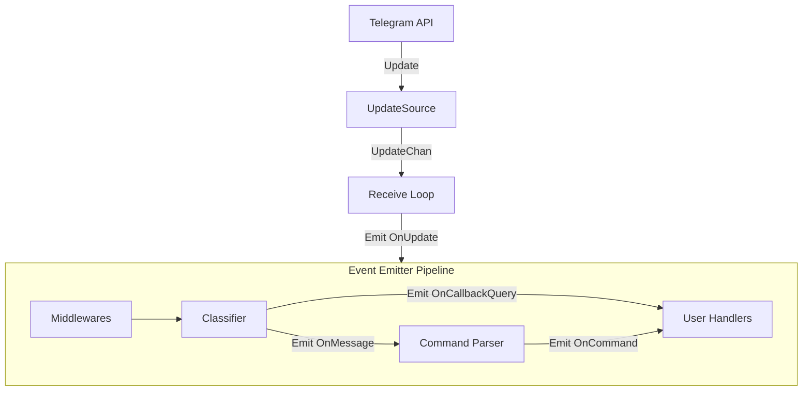

# Architecture

The `tgbotkit-runtime` is built on an event-driven, modular architecture designed for extensibility and ease of use.

## Core Components

### `Bot` Struct
The `Bot` struct (in `bot.go`) is the central orchestrator. It manages:
- **API Client:** A `github.com/tgbotkit/client` instance for interacting with the Telegram Bot API.
- **Event Emitter:** A pluggable `EventEmitter` for dispatching events throughout the system.
- **Handler Registry:** A type-safe registry for subscribing to various bot events.
- **Update Source:** An abstraction (`UpdateSource` interface) for receiving updates from Telegram (e.g., via polling or webhooks).
- **Logger:** A pluggable logging interface.

### `UpdateSource`
An `UpdateSource` is responsible for fetching updates from Telegram and providing them via a channel.
- **Poller:** The default source (`updatepoller` package), which uses long-polling.
- **Webhook:** An alternative source (`webhook` package) that receives updates via HTTP POST requests.

## Lifecycle

### 1. Initialization (`runtime.New`)
When you call `runtime.New`, the following happens:
1. **Option Validation:** Validates the provided configuration.
2. **Default Initialization:** If not provided, it initializes default implementations for the `EventEmitter`, `Logger`, and `client`.
3. **Bot Info Retrieval:** It calls `GetMe` to retrieve the bot's username, which is required for command parsing (e.g., `/start@my_bot`).
4. **Middleware Registration:** Internal middlewares are registered:
   - `ContextInjector`: Injects the `Bot` instance into the `context.Context`.
   - `Logger`: Logs event processing.
   - `Recoverer`: Recovers from panics in listeners or handlers.
5. **Listener Registration:** Core listeners are added to the event emitter:
   - `Classifier`: Listens for `OnUpdate` and emits specific events like `OnMessage`, `OnCallbackQuery`, etc.
   - `CommandParser`: Listens for `OnMessage` and emits `OnCommand` if a command is detected.

### 2. Execution (`Bot.Run`)
The `Run` method starts two main goroutines using an `errgroup`:
1. **Update Source Loop:** Starts the `UpdateSource` (e.g., the poller's long-polling loop or the webhook's HTTP server).
2. **Receive Loop:** Continuously reads updates from the `UpdateSource.UpdateChan()` and emits an `OnUpdate` event for each update.

### 3. Event Processing Pipeline
When an `OnUpdate` event is emitted:
1. **Middleware Chain:** The event passes through all registered global middlewares.
2. **Internal Listeners:**
   - The **Classifier** analyzes the update. If it's a message, it emits `OnMessage`.
   - The **Command Parser** (listening for `OnMessage`) checks if the message is a command. If so, it emits `OnCommand`.
3. **User Handlers:** Any handlers registered by the user for these events are executed.

## Event Flow Diagram

## BotContext
The `Bot` instance implements the `botcontext.BotContext` interface. This interface is injected into every event's `context.Context` by the `ContextInjector` middleware. This allows listeners and handlers to access the bot's capabilities (like the API client or the logger) safely from the context.
